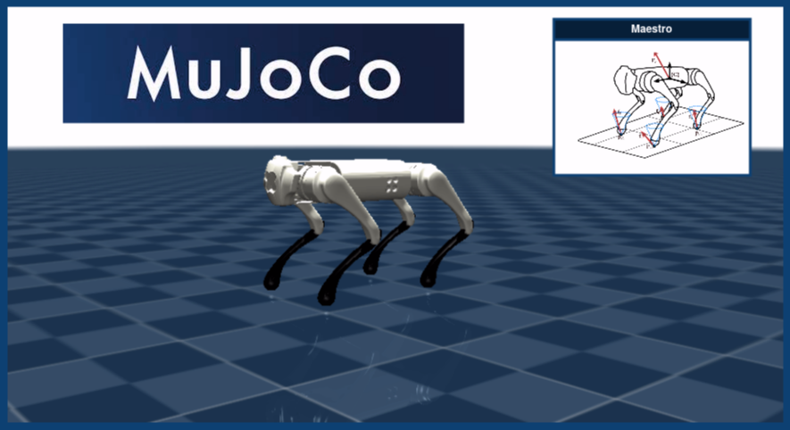

<h1 align="center">


<!-- [](https://www.youtube.com/watch?v=tsgJr0Eto9Y) -->

</h1>

<h1 align="center">
  <br>
  <a href="https://github.com/despargy/maestro_mujoco"></a>
  <br>
  Adaptive Quadruped Locomotion for slippery terrains  <a href="https://mujoco.org/" target="_blank">Mujoco</a>
  <br>

  [Watch the video ▶️](https://www.youtube.com/watch?v=tsgJr0Eto9Y)

</h1>


<h3>Supports: Go1/Go2 for troting locomotion </h3>
<h3 align="center"> The locomotion controller involves velocity tracking for quadrupeds, combing torque adaptation based on foot slip probability (PCE).</h3> <h4 align="left"> An analytical solution, coupled with weighted functions, facilitates adaptation in slippery terrains. Additionally, extra body postures without locomotion are available.  </h4> 

<p align="center">
  <a href="#key-features">Key Features</a> •
  <a href="#releated-packages">Releated Packages</a> •
  <a href="#how-to-use">How To Use</a> •
  <a href="#download">Download</a> •
  <a href="#contact">Contact</a> •
  <a href="#license">License</a>
</p>

## Key Features

The locomotion controller ilustartes a velocity tracking functionwith the additional feature of adapting to a possible slippage of the stance legs. Perfectly tailored for navigating slippery terrains!

Implementing a trajectory tracking controller featuring a potential weighted control effort distribution and time scaling, specifically designed for slippery terrains.

Proposing a novel analytical solution for locomotion, utilizing a weighted control effort distribution for the swinging leg.

## Releated Packages

Upcoming: PCE for cpp
          mujoco-ros for real robot locomotion


The current project's package version, developed for Gazebo and/or the Unitree GO1 robot, is available at <a href="https://github.com/despargy/maestro/tree/master" target="_blank">Maestro ROS</a>
based on previous work for slip detection 
<a href="https://github.com/MichaelMarav/ProbabilisticContactEstimation" target="_blank">Probabilistic Contact Estimation</a>.

## How To Use
<!-- #### Specify the local workspace path within the code lines.: 
   * line 6, src/Data.cpp
   * line 21, src/trajMujoco.cpp
   * line 21, src/walkMujoco.cpp -->


Build .
   ```sh
   cd maestro_mujoco/src/cmake 
   mkdir build_mujoco
   cd build_mujoco
   cmake ..
   make
   ```


Dynamic Troting Locomotion execution.
 ```sh
   cd maestro_mujoco/src/cmake/build_mujoco
   ./dynawalk # Run troting locomotion
   cd maestro_mujoco/src/creat_plots
   python3 plot_slip.py # Vizualize results
   ```

Trajecotry tracking execution.
 ```sh
   cd maestro_mujoco/src/cmake/build_mujoco
   ./traj  # Run trajectory
   cd maestro_mujoco/src/creat_plots
   python3 plot_traj.py # Vizualize results
   ```


  
## Download

   ```sh
   git clone https://github.com/despargy/maestro_mujoco.git
   ```

## Contact
   Despina-Ekaterini Argiropoulos - despinar@ics.forth.gr         

[![LinkedIn][linkedin-shield]][linkedin-url] 


[linkedin-shield]: https://img.shields.io/badge/-LinkedIn-black.svg?style=for-the-badge&logo=linkedin&colorB=555
[linkedin-url]:https://www.linkedin.com/in/despar/


## License

MIT License