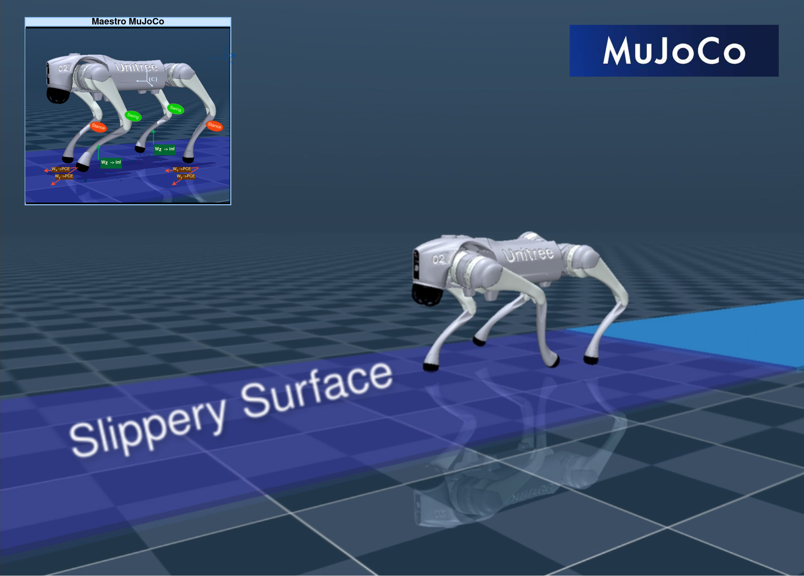

<h1 align="center">


<!-- [](https://www.youtube.com/watch?v=tsgJr0Eto9Y) -->

</h1>

<h1 align="center">
  <br>
  <a href="https://github.com/despargy/maestro_mujoco"></a>
  <br>
  Optimal Torque Distribution via Dynamic Adaptation for Quadrupedal Locomotion on Slippery Terrains <a href="https://mujoco.org/" target="_blank">Mujoco</a>
  <br>

  [Watch the video ▶️](https://www.youtube.com/watch?v=tsgJr0Eto9Y)

</h1>

<h3 align="center"> A real-time adaptive locomotion controller for quadrupeds, designed to maintain stability and controllability on various surfaces, including highly slippery terrains. </h3> 

<h4>Supports: Unitree's Go2</h4>
<p align="center">
  <a href="#key-features">Key Features</a> •
  <a href="#releated-packages">Releated Packages</a> •
  <a href="#how-to-use">How To Use</a> •
  <a href="#download">Download</a> •
  <a href="#contact">Contact</a> •
  <a href="#license">License</a>
</p>

## Key Features

The proposed approach optimizes control effort distribution based on the probability of slippage (PCE) by utilizing a surface-independent adaptation layer. By balancing the robot's redundant kinematic system through rank relaxation —similar to loosening constraints in optimization problems— this method demonstrates significant performance improvements.

By optimizing the output torques at the legs, the controller prevents foot slippage by securing that the contact forces lie inside the friction cone while at the same time ensuring accurate velocity tracking. 
## Releated Packages

Please find the Probabilistic Contact Estimation (PCE) package under the branch <a href="https://github.com/MichaelMarav/ProbabilisticContactEstimation/tree/cpp_main" target="_blank">"cpp_main"</a>.  


<!-- The current project's package version, developed for Gazebo and/or the Unitree GO1 robot, is available at <a href="https://github.com/despargy/maestro/tree/master" target="_blank">Maestro ROS</a>
based on previous work for slip detection 
<a href="https://github.com/MichaelMarav/ProbabilisticContactEstimation" target="_blank">Probabilistic Contact Estimation</a>. -->


## Download

   ```sh
   git clone https://github.com/despargy/maestro_mujoco.git
   ```

   ```sh
   git clone https://github.com/MichaelMarav/ProbabilisticContactEstimation/tree/cpp_main
   ```

## How To Use

Build 
   ```sh
   cd maestro_mujoco/src/cmake 
   mkdir build_mujoco
   cd build_mujoco
   cmake ..
   make -j16
   ```


Run 
 ```sh
   cd maestro_mujoco/src/cmake/build_mujoco
   ./dynawalk # Run troting locomotion
   ```

Check the performance Without Adaptation !
 ```sh
   Edit maestro_mujoco/src/Wrapper.cpp:
      Uncomment l. 479-486
      Comment l. 488 - 503
   "Re-build and Run"
   cd maestro_mujoco/src/cmake/build_mujoco
   make -j16
   ./dynawalk # Run troting locomotion
   ```

  


## Contact
   Despina-Ekaterini Argiropoulos - despinar@ics.forth.gr         

[![LinkedIn][linkedin-shield]][linkedin-url] 


[linkedin-shield]: https://img.shields.io/badge/-LinkedIn-black.svg?style=for-the-badge&logo=linkedin&colorB=555
[linkedin-url]:https://www.linkedin.com/in/despar/


## License

MIT License